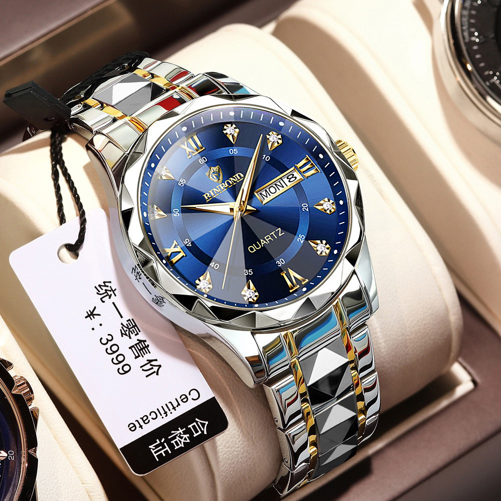

# Website_ADD
<!DOCTYPE html>
<html lang="en">
<head>
    <meta charset="UTF-8">
    <meta name="viewport" content="width=device-width, initial-scale=1.0">
    <title>Customized Watches E-Commerce</title>
    <link href="https://fonts.googleapis.com/css2?family=Poppins:wght@300;400;600;700&display=swap" rel="stylesheet">
    
</head>
<body>
    <header>
        <h1>Watchify</h1>
            <nav>
                <a href="#" onclick="showSection('products')">Home</a>
                <a href="#" onclick="scrollToShop()">Shop</a>
                <a href="#" onclick="showSection('cart')">Cart</a>
                <a href="#" onclick="showSection('profile')">Profile</a>
                <a href="#" onclick="showSection('about')">About</a>

            </nav>
        </header>
        
    </header>

    

        

            <h2>Login</h2>
            <form onsubmit="handleLogin(event)">
                <label for="username">Username</label>
                <input id="username" type="text" placeholder="Username" required>
                <label for="email">Email</label>
                <input id="email" type="email" placeholder="Email" required>
                <label for="mobile">Mobile Number</label>
                <input id="mobile" type="text" placeholder="Mobile Number" required>
                <label for="password">Password</label>
                <input id="password" type="password" placeholder="Password" required>
                

                    <input type="checkbox" required> I agree to the terms and conditions
                

                <button type="submit">Login</button>
            </form>
        

    

    

        

            <h2>Welcome to Watchify</h2>
            
Discover our exclusive collection of customized watches. At Watchify, we blend elegance and personalization to bring you the perfect timepiece for every occasion. Start exploring now!

        

        <input type="text" id="search" class="search-bar" oninput="searchProduct()" placeholder="Search Watches...">
        

            <select id="genderFilter" onchange="filterProducts()">
                <option value="">Select Gender</option>
                <option value="Men">Men</option>
                <option value="Women">Women</option>
            </select>
            <select id="priceFilter" onchange="filterProducts()">
                <option value="">Select Price Range</option>
                <option value="100">Under $100</option>
                <option value="200">$100 - $200</option>
                <option value="300">$200 - $300</option>
            </select>
        

        <h2 style="text-align: center; font-size: 2rem; color: white;">Our Watches</h2>
        

            <!-- Example products -->
            

                
                <h3>Elegant Watch</h3>
                
$120

                <button onclick="addToCart('Elegant Watch', 120)">Add to Cart</button>
                <a href="product_details.html?id=1"><button>View Details</button></a>
            

            

                
                <h3>Classic Watch</h3>
                
$150

                <button onclick="addToCart('Classic Watch', 150)">Add to Cart</button>
                <a href="product_details.html?id=2"><button>View Details</button></a>
            

            

                
                <h3>Blegant Watch</h3>
                
$1120

                <button onclick="addToCart('Blegant Watch', 1120)">Add to Cart</button>
                <a href="product_details.html?id=1"><button>View Details</button></a>
            

            

                
                <h3>Blegant Watch</h3>
                
$15120

                <button onclick="addToCart('lentergant Watch', 15120)">Add to Cart</button>
                <a href="product_details.html?id=1"><button>View Details</button></a>
            

            

                
                <h3>Linter Watch</h3>
                
$1520

                <button onclick="addToCart('Linter Watch', 1520)">Add to Cart</button>
                <a href="product_details.html?id=1"><button>View Details</button></a>
            

            

                
                <h3>Cluster Watch</h3>
                
$3020

                <button onclick="addToCart('Clusster Watch', 3020)">Add to Cart</button>
                <a href="product_details.html?id=1"><button>View Details</button></a>
            

            

                
                <h3>Bloteer Watch</h3>
                
$1720

                <button onclick="addToCart('Bloter Watch', 1720)">Add to Cart</button>
                <a href="product_details.html?id=1"><button>View Details</button></a>
            

        

    

    

        <h2 style="text-align: center; font-size: 2rem; color: white;">Your Cart</h2>
        <ul id="cart-items" style="list-style: none; padding: 0; color: white; font-size: 1.2rem;"></ul>
        <button onclick="proceedToPayment()" style="margin-top: 1rem; padding: 0.8rem 1.5rem; background: #4facfe; color: white; border-radius: 6px;">Proceed to Payment</button>
    

    

        <h2 style="color: #fff;">Payment</h2>
        
Select Payment Type:

        <select id="payment-type">
            <option value="UPI">UPI</option>
            <option value="Card">Credit/Debit Card</option>
        </select>
        <button onclick="showQRCode()">Generate QR Code</button>
        

    

    

        

            

                <h2>About Watchify</h2>
                
Founded in 2020, Watchify aims to revolutionize the watch industry with bespoke, customizable timepieces that resonate with individual styles. We combine innovation with craftsmanship to deliver unique watches for every occasion.

                
Our mission is to provide timeless designs with a personal touch, ensuring our customers always have the perfect timepiece for every moment.

            

        

        
        

            <h2>Your Profile</h2>
            
Name: 

            
Email: 

            
Mobile: 

        

    <!-- Add this modal HTML near the end of the body -->

    

        &times;
        <h2 id="modal-title"></h2>
        
        

        

        <button onclick="addToCartFromModal()">Add to Cart</button>
    

<!-- Update styles in the 

<!-- Update the JavaScript to include modal functionality -->

<!-- Update each product card to use the modal -->

    
    <h3>Elegant Watch</h3>
    
$120

    <button onclick="addToCart('Elegant Watch', 120)">Add to Cart</button>
    <button onclick="openModal('Elegant Watch', 120, 'watch1.jpg', 'A sleek and stylish watch perfect for any occasion.')">View Details</button>

    
    <h3>Classic Watch</h3>
    
$150

    <button onclick="addToCart('Classic Watch', 150)">Add to Cart</button>
    <button onclick="openModal('Classic Watch', 150, 'watch2.jpg', 'A classic design to match your timeless style.')">View Details</button>

    
</body>
</html>
